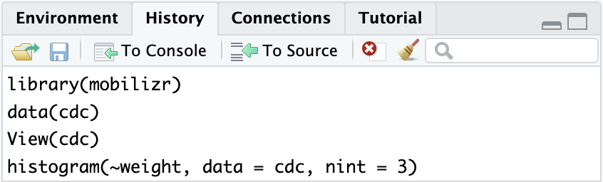

```{r, eval=TRUE, echo=FALSE, results='hide', message=FALSE, warning=FALSE}
library(mobilizr)
data(cdc)
```

## Where'd we leave off ...

- In the previous lab, we started to get acquainted with the layout of RStudio and some of the commands.
- In this lab, we'll learn about different _types_ of variables. 
    - Such as those that are measured by numbers and others that have values that are categories.
- We'll also look at ways to visualize these different types of data using _plots_ (a word data scientists use interchangeably with the word _graph_).
- <span class="blue">Find the _History_ tab in RStudio and click on it. Figure out how to use the information to reload the `cdc` data.</span>


## Variable Types

- Numerical variables have values that are measured in units.
- Categorical variables have values that describe or categorize our observations.
- <span class="blue">`View` your `cdc` data and find the columns for `height` and `sex` (use the _History_ pane again if you need help to `View` your data).</span>
    - **(1) Is `height` a numerical or categorical variable? Why?**
    - **(2) Is `sex` a numerical or categorical variable? Why?**
    - **(3) List either the different categories or what you think the measured units are for `height` and `sex`.**

    
## Which is which?

- <span class="blue">Run the code you used in the previous lab to display the `names` of your `cdc` data's variables (use the code displayed in the _History_ pane to resubmit previously typed commands).</span> 

<center> { width=60% }</center>

- **Use the code's output to help you complete the following:**
    - **(4) Write down 3 variables that you think are _categorical_ variables and why.**
    - **(5) Write down 3 variables that you think are _numerical_ variables and why.**

## Data Structures

- One way to get a good summary of your data is to look at the data's _structure_.
    - One way to view this info would be to click on the little blue arrow next to `cdc` in the _Environment_ pane.
    - Another way would be to run the following in the _console_:
```{r, eval = FALSE, echo = TRUE}
str(cdc)
```

- **(6) What information does the `str` function output?**
- **(7) Were you able to correctly guess which variables were categorical and numeric? Which ones did you mislabel?**
    

## Visualizing data

- Visualizing data is a really helpful way to learn about our variables.
- **(8) Choose one numeric variable. Write and run the codes to create a `bargraph` and a `histogram`.**
- **(9) Now choose one categorical variable. Write and run the codes to create a `bargraph` and a `histogram`.**
- **(10) Which function, either `bargraph` or `histogram`, is better at visualizing categorical variables? Which is better at visualizing numerical variables?**
    
## We have options

- **(11) Write and run the code to make a graph that shows the distribution of people's `weight`.**
  - **(12) Describe the distribution of `weight`. Make sure to describe the _shape_, _center_ and _spread_ of the distribution.**

- _Options_ can be added to plotting functions to change their appearance. The code below includes the `nint` option which controls the number of _intervals_ in a numerical plot.
  - Options, also known as _arguments_, are additional pieces of information you provide to a function, and are separated by commas.
  - <span class="blue">Type the command below on your console and then answer the questions that follow:</span>
```{r, eval = FALSE, echo = TRUE}
histogram(~weight, data = cdc, nint = 3)
```
-
  - **(13) How did including the option `nint = 3` change the `histogram`?**
  - **(14) Does setting `nint = 3` impact how you would describe the shape, center and spread?**
  - **(15) Try other values for `nint`. What value produced the best graph? Why?**
 
## How often do people text & drive?

- **(16) Write and run the code to make a graph that shows how often people in our data texted while driving.**
    - **(17) What does the y-axis represent?**
    - **(18) What does the x-axis tell us?**
    - **(19) Would you say that _most_ people _never_ texted while driving? What does the word _most_ mean?**
    - **(20) Approximately what percent of the people texted while driving for 20 or more days?** (Hint: There are `r nrow(cdc)` students in our data.)


## Does texting and driving differ by sex?

- **(21) Write and run the code to make a side-by-side `bargraph` that could answer the question: _Does texting and driving differ by sex?_ Use the following fill-in-the-blank code as a hint.**

```{r, eval = FALSE, echo = TRUE}
bargraph(~ ___, data = ___, groups = ___)
```

- **(22) Write a sentence explaining how boys and girls differ when it comes to texting while driving.**
- **(23) Would you say that most girls never text and drive?  Would you say that most boys never text and drive?**
- **(24) How did including the `groups` argument in your code change the graph?**


## Do males and females have similar heights?

- To answer this, what we'd like to do is visualize the distributions of heights, separately, for males and females.
    - This way, we can easily compare them.
- **(25) Write and run the code to create a `histogram` for the `height` of males and females using the `groups` argument.**
    - **(26) Can you use this graphic to answer the question at the top of the slide? Why or why not?**
    - **(27) Is grouping numeric values, such as heights, as helpful as grouping categorical variables, such as texting & driving?**
    

## Do males and females have similar heights?, continued

- Why does this work for bargraphs but not for histograms?
    - The `groups` argument uses color to differentiate between groups.
    - With bargraphs, each group is split with bars next to each other on the x-axis. 
    - With histograms, the x-axis is a continuous set of numbers so the bars overlap making it difficult to compare center and spread.

- **(28) Write and run the code to create a split `histogram` and answer the questions below.**

```{r, eval = FALSE, echo = TRUE}
histogram(~ ____ | ____ , data = ____ )
```

- **(29) Do you think males and females have similar heights? Use the plot you create to justify your answer.**
- **(30) Just like we did for the `histogram`, is it possible to create a _split_ `bargraph`? Write and run the code to create a `bargraph` of `drive_text` that is split by `sex` to find out.**

## On your own

- In this lab, we looked at the texting & driving habits of boys and girls. 
- **(31) What other factors do you think might affect how often people text and drive?**
- **(32) Choose one variable from the `cdc` data, make a graph, and use the graph to describe how `drive_text` use differs with this variable.**